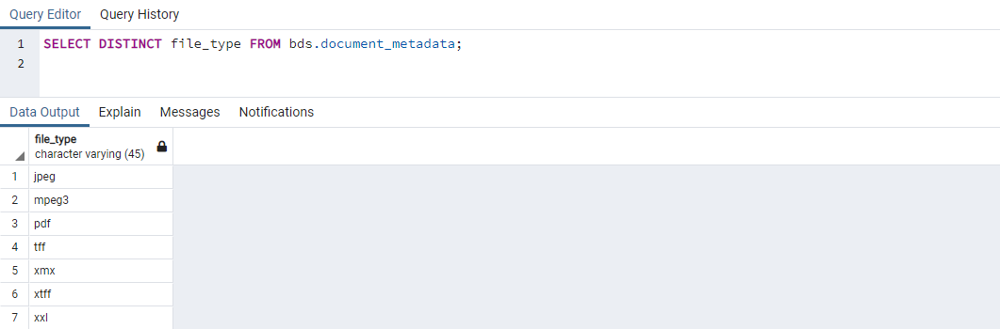

# Project Assignment – SQL

Here you can find all SQL statements from the [Project Assignment 2](./../docs/BPC_BDS_SP_Assignment_2.pdf).

## Statements – series of queries

### Retrieve only selected columns from the selected table
```
SELECT first_name, last_name, email FROM bds.persons;
```


### Select person based on the email
```
SELECT first_name, last_name, email, phone FROM bds.persons 
  WHERE email = 'bsavinec@techcrunch.com';
```


### UPDATE, INSERT, DELETE and ALTER TABLE 
```
UPDATE bds.projects SET description = 'Pentesting website vut.cz' 
  WHERE slug = 'but';

INSERT INTO bds.vulnerabilities (slug, title, cve, description, created_at, updated_at) 
  VALUES ('jetbrains-hub','JetBrains Hub XSS','CVE-2021-43181', 'Possible stored XSS in JetBrains Hub.', now(), now());

DELETE FROM bds.projects 
  WHERE slug = 'muni';

ALTER TABLE bds.checklists 
  ALTER description 
  TYPE character varying(12000);
```


### WHERE
```
SELECT title FROM bds.categories
  WHERE slug = 'apache';
```


### LIKE
```
SELECT first_name, last_name, email FROM bds.persons 
  WHERE email LIKE 'c%';
```


### NOT LIKE
```
SELECT title, description FROM bds.checklists 
  WHERE title NOT LIKE '%AVSS%';
```


### SUBSTRING
```
SELECT CONCAT(SUBSTRING(first_name, 1, 1), '.', SUBSTRING(last_name, 1, 1), '.') AS initials FROM bds.persons;
```


### TRIM
```
SELECT TRIM(title) AS title_trim FROM bds.checklists;
```


### COUNT
```
SELECT COUNT(id_project) AS total_projects FROM bds.projects;
```


### SUM
```
SELECT SUM(file_size) AS total_files_size FROM bds.document_metadata;
```


### MIN
```
SELECT MIN(file_size) AS smallest_file FROM bds.document_metadata;
```


### GROUP BY
```
SELECT COUNT(id_target) AS targets_per_category FROM bds.targets 
  GROUP BY id_category;
```


### GROUP BY and HAVING
```
SELECT id_person, COUNT(id_log) AS logs_per_person FROM bds.logs 
  GROUP BY id_person 
  HAVING COUNT(id_log) > 5;
```


### GROUP BY, HAVING and WHERE
```
SELECT id_category, AVG(id_category)::numeric(10,2) AS target_category_average FROM bds.targets 
  WHERE address LIKE '%.com' 
  GROUP BY id_category 
  HAVING COUNT(id_target) > 5;
```


### UNION
```
SELECT p1.title, p1.start_date, p1.end_date 
  FROM bds.projects p1 
  WHERE p1.start_date < '2021-08-20' 
  UNION SELECT p2.title, p2.start_date, p2.end_date 
  FROM bds.projects p2 
  WHERE p2.start_date > '2021-09-20';
```


### DISTINCT
```
SELECT DISTINCT file_type FROM bds.document_metadata;
```


### LEFT JOIN; RIGHT JOIN; FULL OUTER JOIN
```
SELECT t.title, t.address, v2t.description FROM bds.targets t 
  LEFT JOIN bds.vulnerability2target v2t ON v2t.id_target = t.id_target;

SELECT r.title AS role_title, rt.title AS role_type_title FROM bds.roles r 
  RIGHT JOIN bds.role_types rt ON rt.id_role_type = r.id_role_type;

SELECT p.title AS project_title, t.title AS task_title, t.description AS task_description FROM bds.projects p 
  FULL OUTER JOIN bds.tasks t ON t.id_project = p.id_project;
```


### LEFT JOIN, GROUP BY, HAVING, ORDER BY, AVG and DISTINCT

```
SELECT DISTINCT p.title, AVG(dm.file_size)::numeric(10,2) AS average_project_files_size FROM bds.projects p 
  LEFT JOIN bds.document2project d2p ON d2p.id_project = p.id_project 
  JOIN bds.documents d ON d.id_document = d2p.id_document
  JOIN bds.document_metadata dm ON dm.id_document = d.id_document
  GROUP BY p.id_project 
  HAVING p.start_date > '2021-05-20 12:00:00'
  ORDER BY p.title DESC;
```


### Select data from table for the last one and half days
```
SELECT log_event FROM bds.logs
  WHERE log_timestamp > current_timestamp - interval '1 day' + '12 hours';
```


### Select data from the last month
```
SELECT log_event FROM bds.logs
  WHERE log_timestamp >= date_trunc('month', current_date - interval '1' month) 
  AND log_timestamp < date_trunc('month', current_date);
```


### Remove accents on a selected string
```
CREATE EXTENSION unaccent;
SELECT unaccent(first_name) AS first_name, unaccent(last_name) AS last_name FROM bds.persons;
```


### LIMIT and OFFSET
```
SELECT first_name, last_name, email FROM bds.persons 
  LIMIT 5 
  OFFSET 2;
```


### Subquery in FROM
```
SELECT id_role_type, total_roles 
  FROM (SELECT id_role_type, COUNT(id_role_type) AS total_roles FROM bds.roles GROUP BY id_role_type) AS roles;
```


### Subquery in WHERE condition
```
SELECT p.first_name, p.last_name, p.email FROM bds.persons p 
  WHERE 2 = (SELECT count(id_person) FROM bds.person2project b2p WHERE b2p.id_person = p.id_person);
```


### Aggregate function and GROUP BY with HAVING
```
SELECT t.title, t.address, COUNT(v2t.id_target) as total_vulnerabilites FROM bds.targets t 
  JOIN bds.vulnerability2target v2t ON v2t.id_target = t.id_target 
  GROUP BY t.id_target 
  HAVING COUNT(v2t.id_target) > 1;
```


### Join 5 tables
```
SELECT p.title AS project_title, v.title AS vulnerablity_title, v.cve, v.description FROM bds.projects p 
  JOIN bds.tasks t1 ON t1.id_project = p.id_project 
  JOIN bds.target2task t2t ON t2t.id_task = t1.id_task
  JOIN bds.targets t2 ON t2.id_target = t2t.id_target
  JOIN bds.vulnerability2target v2t ON v2t.id_target = t2.id_target
  JOIN bds.vulnerabilities v ON v.id_vulnerability = v2t.id_vulnerability;
```


### Join 4 tables with GROUP BY, HAVING, and WHERE
```
SELECT c.title, COUNT(t2.id_target) FROM bds.projects p
  JOIN bds.tasks t1 ON t1.id_project = p.id_project 
  JOIN bds.target2task t2t ON t2t.id_task = t1.id_task
  JOIN bds.targets t2 ON t2.id_target = t2t.id_target
  JOIN bds.categories c ON c.id_category = t2.id_category
  WHERE p.slug = 'but'
  GROUP BY c.id_category
  HAVING COUNT(t2.id_target) > 1;
```


## Statements – database operations

### Unique constraints, indexes, cascading, etc.

See files containing word ***schema*** with the highest ***V*** prefix from the `db/migration/postgresql` directory.

### Cascading
Cascade delete/update is used to delete/update referenced records (by foreign key) from other tables if corresponding record is deleted/updated (by primary key).

#### Cascading example
```
ALTER TABLE bds.targets
  ADD CONSTRAINT fk_targets FOREIGN KEY (id_category) REFERENCES bds.categories(id_category) ON DELETE SET NULL;
  
ALTER TABLE bds.vulnerability2target
  ADD CONSTRAINT fk_vulnerability2target1 FOREIGN KEY (id_target) REFERENCES bds.targets(id_target) ON DELETE CASCADE;
```

### Indexes
PostgreSQL provides several index types: B-tree, Hash, GiST, SP-GiST, GIN and BRIN.

#### Unique indexes creation example
```
CREATE UNIQUE INDEX idx_persons_email ON bds.persons(email);
```

Indexes speed up a select, but slow down inserts, updates and deletes because the database engine have to write the index together with the data.

#### Index speed performance
Select all projects based on title without index:
```
EXPLAIN SELECT t.title, t.address, v2t.description FROM bds.targets t 
  LEFT JOIN bds.vulnerability2target v2t ON v2t.id_target = t.id_target
  WHERE t.title = 'Andalax';

-- Hash Right Join  (cost=5.59..17.37 rows=134 width=535)
```

Select all projects based on title with index:
```
CREATE UNIQUE INDEX idx_targets_title ON bds.targets(title);

EXPLAIN SELECT t.title, t.address, v2t.description FROM bds.targets t 
  LEFT JOIN bds.vulnerability2target v2t ON v2t.id_target = t.id_target
  WHERE t.title = 'Andalax';

-- Hash Right Join  (cost=4.84..16.62 rows=4 width=535)
```

### Database procedure

```
CREATE OR REPLACE PROCEDURE bds.remove_person_from_project(IN person int, IN project int) 
LANGUAGE SQL
AS $$
    DELETE FROM bds.person2project 
		WHERE id_person = person AND id_project = project;
    DELETE FROM bds.document2project d2p
        USING bds.documents d
		WHERE d.id_person = person AND id_project = project;
    INSERT INTO bds.logs (id_person, log_event, log_timestamp) VALUES (person, 'User has been removed from the project', now());
$$;
```


### Database function and trigger
```
CREATE FUNCTION bds.check_file_extension() RETURNS trigger 
AS $$
    BEGIN
        IF NEW.file_type NOT IN ('pdf', 'ppt', 'jpeg') THEN
            RAISE EXCEPTION 'This file extension is not allowed!';
        END IF;
        NEW.created_at := current_timestamp;
        NEW.updated_at := current_timestamp;
        RETURN NEW;
    END;
$$ LANGUAGE plpgsql; 

CREATE TRIGGER check_file_extension
    BEFORE INSERT ON bds.document_metadata
    FOR EACH ROW EXECUTE PROCEDURE bds.check_file_extension();
```


### Database view
```
CREATE VIEW bds.persons_view AS SELECT id_person, first_name, last_name, email, phone FROM bds.persons;
```


### Database materialized view
Materialized views cache the result of a complex and expensive query so that someone can access the data without having to perform the query.
They cannot be updated directly, and the query used to create the materialized view (see screenshot below) is stored in the same way as the view query.
They are useful if they are used frequently and the source needs to access them quickly.
A materialized view can be refreshed periodically to create an updated version of the view.

#### Materialized view creation
```
CREATE MATERIALIZED VIEW bds.project_vulnerabilities AS
  SELECT p.title, COUNT(v2t.id_vulnerability) AS total_vulnerabilities 
  FROM bds.projects p 
  JOIN bds.tasks t1 ON t1.id_project = p.id_project 
  JOIN bds.target2task t2t ON t2t.id_task = t1.id_task
  JOIN bds.targets t2 ON t2.id_target = t2t.id_target
  JOIN bds.vulnerability2target v2t ON v2t.id_target = t2.id_target
  JOIN bds.vulnerabilities v ON v.id_vulnerability = v2t.id_vulnerability
  JOIN bds.categories c ON c.id_category = t2.id_category
  WHERE v.cve IS NOT NULL
  GROUP BY p.id_project
  HAVING COUNT(t1.id_task) > 5;
```


### Roles and privileges
```
CREATE ROLE teacher NOSUPERUSER LOGIN ENCRYPTED PASSWORD 'P0KgQv3cg*!7Pw2@9$2d';
GRANT ALL ON bds.projects TO teacher;
GRANT ALL ON bds.documents TO teacher;
GRANT SELECT ON bds.persons_view TO teacher;
CREATE ROLE student NOSUPERUSER LOGIN ENCRYPTED PASSWORD 'o5tqOuATEV5H@GH9&GSx';
GRANT SELECT ON bds.projects TO student;
GRANT SELECT ON bds.documents TO student;
```


